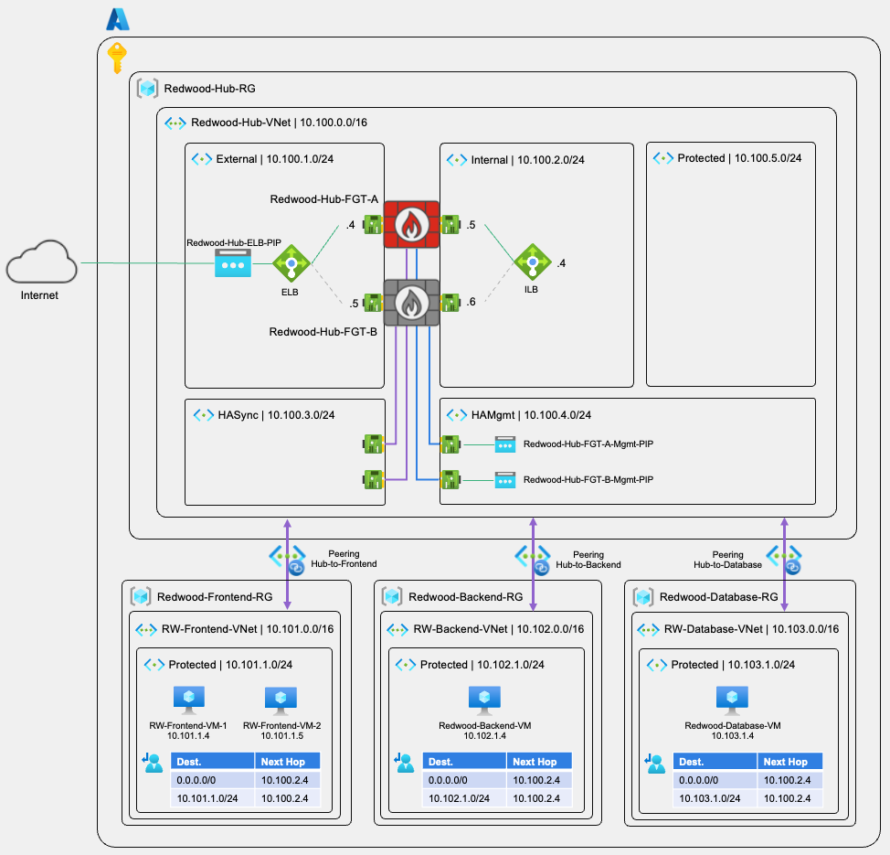

# AZ-102: FortiGate HA with Multi-VNet Hub-Spoke Architecture

## Fortinet Security Hands On Workshop | Azure Series

### Welcome

Building on the foundational skills from AZ-101, this advanced workshop addresses the challenges organizations face when scaling their Azure security infrastructure. As cloud deployments grow beyond a single VNet, maintaining consistent security policies, ensuring high availability, and managing complex traffic flows between multiple network segments becomes critical. Many organizations struggle with designing resilient security architectures, implementing proper network segmentation, and achieving both north-south (internet) and east-west (inter-VNet) traffic inspection without creating bottlenecks or single points of failure.

In this workshop, participants will deploy FortiGate in Active-Passive High Availability mode to protect a multi-VNet environment. Using Redwood Industries' expansion scenario, you'll build a hub-spoke topology with three spoke VNets (frontend, backend, database), configure vNet Peering and User Defined Routes for comprehensive traffic inspection, and establish complete visibility across the entire network fabric. This architecture represents real-world enterprise deployments and prepares you for production-scale implementations.

At the core of this solution is FortiGate HA with Azure Load Balancers (ELB/ILB), providing automatic failover and centralized security inspection. You'll learn how to leverage Azure's infrastructure for resilience while maintaining the security capabilities and operational consistency that FortiGate provides across hybrid environments.

### Time Requirements

The estimated time to complete this workshop is **3 hours**.

### Target Audience

- Cloud security architects designing multi-VNet environments
- Network security engineers implementing HA solutions
- Fortinet presales engineers and consultants
- IT professionals responsible for enterprise Azure deployments
- Partners expanding their FortiGate Azure practice
- Security operations teams managing hybrid infrastructure

**Experience Level:** Intermediate to Advanced professionals with AZ-101 completion or equivalent hands-on experience.

### What You'll Learn

- Design centralized security topology with FortiGate HA in the hub and multiple spoke VNets, including IP addressing strategy
- Configure Active-Passive high availability, failover mechanisms, and health probes
- Configure both External Load Balancer (for internet traffic) and Internal Load Balancer (for east-west inspection) with FortiGate
- Create route tables across VNets and implement user-defined routes to force traffic through the security hub
- Understand north-south (internet) and east-west (inter-VNet) traffic flows, including asymmetric routing
- Build security policies for different traffic types and configure outbound NAT
- Use FortiView, logs, and packet captures for traffic analysis and connectivity validation
- Test failure scenarios and demonstrate resilience for business value/ROI discussions

### Reference Architecture

After completing this workshop, you will have deployed the following architecture:

All traffic flows through FortiGate HA for inspection
UDRs force traffic to Internal Load Balancer (10.100.2.4)

## Laboratories

This workshop is organized in sequential laboratories, building on concepts from AZ-101.

**Lab 1** - [Hub VNet Infrastructure and FortiGate HA Deployment](/az-102-lab1/README.md)  
**Lab 2** - [Spoke VNets Deployment and VNet Peering](/az-102-lab2/README.md)  
**Lab 3** - [User-Defined Routes Configuration](/az-102-lab3/README.md)  
**Lab 4** - [Security Policies and Testing](/az-102-lab4/README.md)

---

> [!NOTE]
> The workshop provides examples and sample code as instructional content. These examples help you understand FortiGate HA deployment and multi-VNet architecture. **Please note that these examples are not suitable for use in production environments without proper testing, security hardening, and customization for your specific requirements**.

---

> [!CAUTION]
> This lab uses several Azure resources including multiple VMs and load balancers. **Expected costs: $20 for the 3-hour workshop if resources are deleted immediately after**. At the end of the workshop, delete all resource groups to avoid ongoing charges or at least stop the VMs if you don't want any unpleasant surprises.

---

> [!WARNING]
> This lab deploys resources across multiple VNets with complex routing. If using a production subscription, use extreme caution with route table configuration to avoid impacting existing workloads. **We strongly recommend using an isolated test subscription for this workshop**.

---

### Additional Resources

**Fortinet Documentation:**

- FortiGate Azure HA Guide: <https://docs.fortinet.com/document/fortigate-public-cloud/7.6.0/azure-administration-guide/161167/deploying-fortigate-vm-ha-in-azure>
- Hub-Spoke Architecture: <https://docs.fortinet.com/document/fortigate-public-cloud/7.6.0/azure-administration-guide/849193/hub-and-spoke-topology>

**Azure Documentation:**

- Hub-Spoke Network Topology: <https://learn.microsoft.com/azure/architecture/reference-architectures/hybrid-networking/hub-spoke>
- Azure Load Balancer: <https://learn.microsoft.com/azure/load-balancer/>
- User-Defined Routes: <https://learn.microsoft.com/azure/virtual-network/virtual-networks-udr-overview>

---

*Workshop Version 1.0* - *December 2024*
